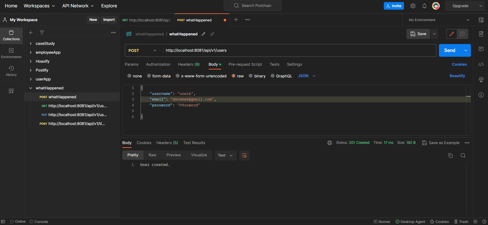
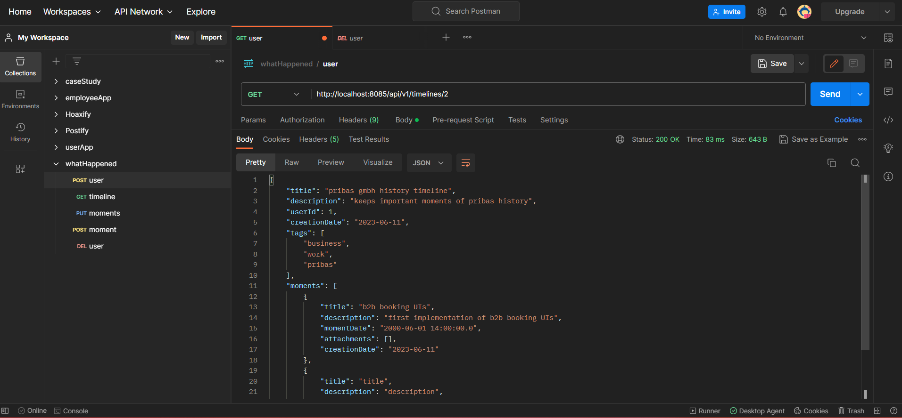
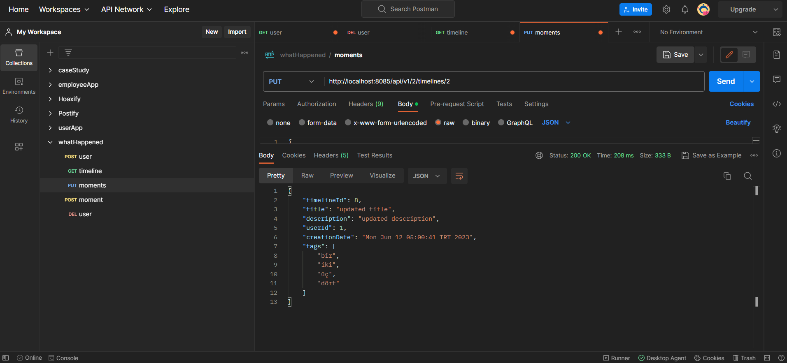
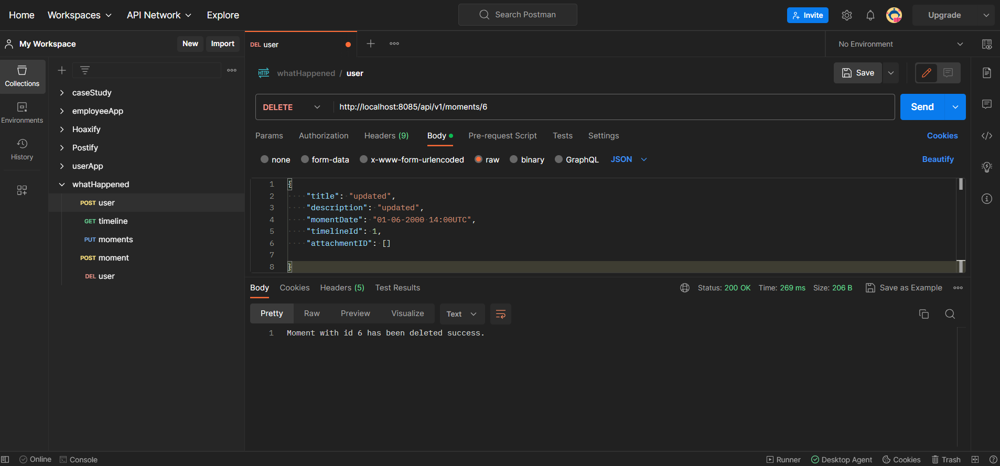
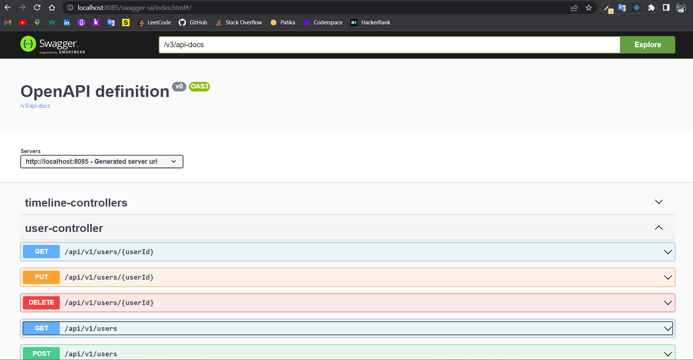
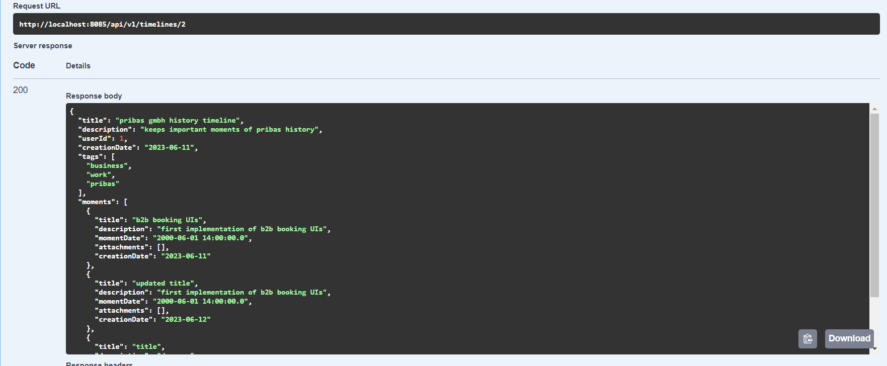
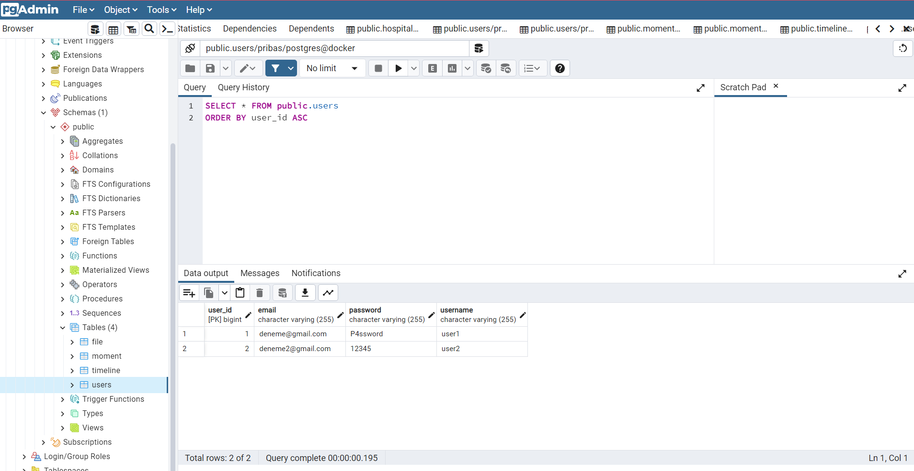
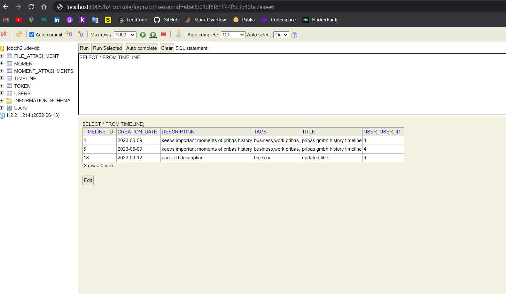

# WHAT HAPPENED?

The purpose of this web application;

- A tool  to track important moments with exact date time information and attached  documents to answer  one question: What Happened?

- All events, moments etc. can be created  in a timeline and can be tagged.

## Technologies

- Some technologies used in this application are:
    - `Java & Spring Boot`
    - `PostgreSQL & pgAdmin`
    - `H2-Database (for convenience during development)`
    - `Dockerfile & docker-compose.yaml`
    - `Swagger & Open API & Postman`
    - `Intellij IDEA`

### Images

- `POST Mapping` :

- `GET Mapping` :

- `PUT Mapping` :

- `DELETE Mapping` :

- `Swagger` :

- `Swagger_GET` :

- `Database - PostgreSQL` :

- `Database - H2` :

